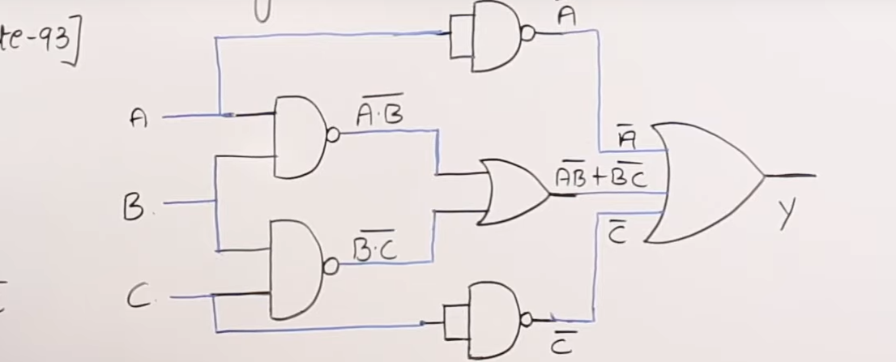

# Logic Gates

```
  npm i logic-gate
```

## Example
```
const gates = requrie('logic-gate');
gates.and(1,1); //true
gates.and(true,false); //false
gates.and(1,0, ()=>{
  return false
}); //false
```
## Supported Gates
* and
* nand
* nor
* not
* xor
* xnor
* or

## Example

  
  The simplified answer is
```
   !a + !b + !c
```


```

  const gate = requrie('logic-gate');

  let [a, b, c] = [
      1,1,1
  ]

  let complicated = gate.or(
                      gate.not(a),
                      gate.or(
                          gate.nand(a, b),
                          gate.nand(b, c)
                      ),
                      gate.not(c)
  )

  let simplified = gate.or(gate.not(a), gate.not(b), gate.not(c));

  console.log(simplified, complicated);
```
